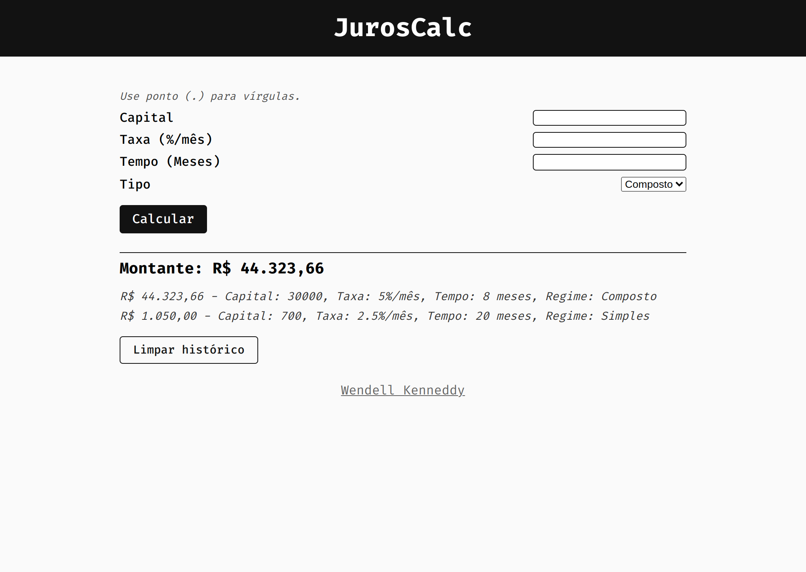

# JurosCalc

---

## 📕 About

JurosCalc is a simple interest calculator.

---

## ⚒️ Used Technologies

To develop this app, I used these technologies:

- Javascript
- HTML5
- CSS3

---

## ✨ Features

- Responsivity
- Calculation of simple and compound interest
- Storing calculations history on localStorage

---

## ⚙️ How to Use

First, clone the repository.

Inside the project folder, run `yarn` or `yarn install` to install the dependencies.

Populate your `.env.development.local` with your environment variables. Check the `.env.example` for more info.

Then, run `yarn dev` to start a local development server.

---

## 🤝 Be a Contributor

Have any idea that can help boost the project, and want to share it? It's simple!

1. Fork the project
2. Modify what you want
3. Commit the changes
4. Open a Pull Request

---

## 🔓 License

This project is under license. Click [here](./LICENSE.md) for details.
